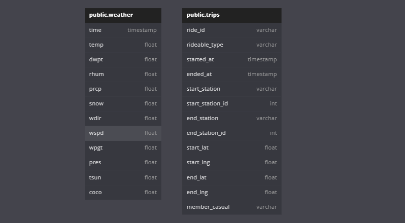
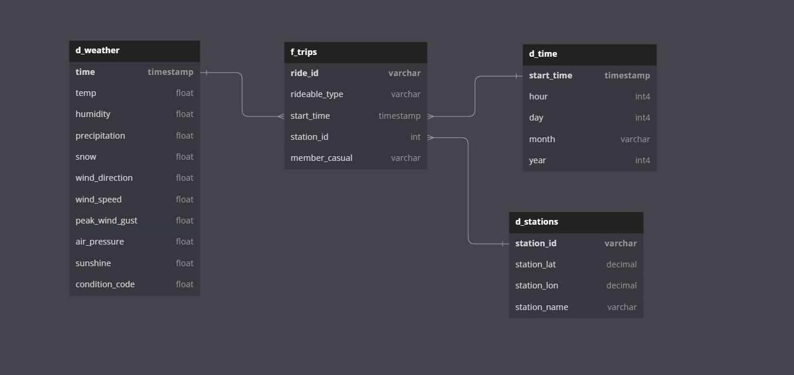
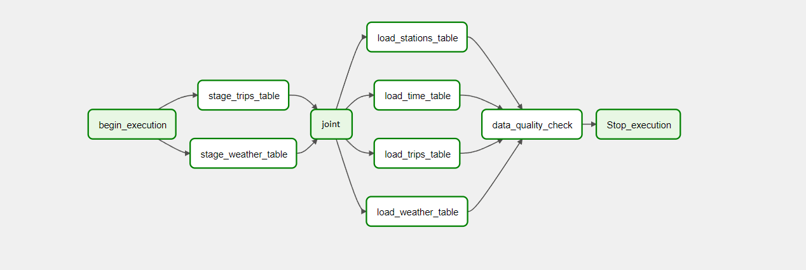

# Data Pipelines with Airflow

## Overview

Runs an ELT data pipeline using Apache-Airflow to collect weather data from [meteostat](https://dev.meteostat.net/python/)
Python API and trips data from a bike share company located in Washington, D.C., and combines both datasets into a star
schema in Redshift to create an easy-to-use and analyze model for machine learning to make predictions on the number of
bike share users in relation to weather. The pipeline will execute monthly and update the data in the cluster

---

## Data

### Bike share trips

[Capital Bikesahre](https://ride.capitalbikeshare.com/system-data), since the data stored in S3
are formatted as 'zip', and Redshift is unable to process them with a 'Copy' command into Redshift. I transferred the unzipped
files into a new S3 bucket(s3://gz-capitalbikeshare-data), which can be done via script or using [S3FileTransformOperator]
(https://airflow.apache.org/docs/apache-airflow-providers-amazon/stable/_api/airflow/providers/amazon/aws/operators/s3/index.html),
Note: I'm planning to add a script to the project to fully automate the pipeline.
Files' name come in the format: YYYYMM-capitalbikeshare-tripdata.csv

### Weather
[Meteostat](https://dev.meteostat.net/python/)'s python API, which provides weather and climate data, given a time interval and
location, in form of a pandas DataFrame, that looks as shown below:

**column_name, description, type**:
- `time` The datetime of the observation	        Datetime64
- `temp` The air temperature in °C	                Float64
- `dwpt` The dew point in °C	                    Float64
- `rhum` The relative humidity in percent (%)	    Float64
- `prcp` The one hour precipitation total in mm	    Float64
- `snow` The snow depth in mm	                    Float64
- `wdir` The average wind direction in degrees (°)	Float64
- `wspd` The average wind speed in km/h	            Float64
- `wpgt` The peak wind gust in km/h	                Float64
- `pres` The average sea-level air pressure in hPa	Float64
- `tsun` The one hour sunshine total in minutes (m)	Float64
- `coco` The weather condition code	                Float64

---

## How to run

Made with python version: 3.10.1

python -m pip freeze > requirements.txt
python -m pip install -r requirements.txt

### Packages
- meteostats 1.6.5
- airflow 2.4.1

### Prerequisites:
- Create an IAM User in AWS with appropriate permissions.
- Create a redshift cluster in AWS. Ensure that you are creating this cluster in the us-west-2 region since the S3
bucket used is located in said region.
- [Start](https://airflow.apache.org/docs/apache-airflow/2.4.1/start.html) an Airflow web server with the compatible version.

### Steps
Once in the airflow web UI:
- add Redshift and AWS credentials to the connections by going to Admin -> connections -> Create
- run create_tables dag and wait for the dag to finish
- run load_data dag (this might take a long time to complete all the tasks)

---

## Schema
 
All data is first staged into two tables in Redshift, then, usable data is copied to different tables
building a [Star schema](https://en.wikipedia.org/wiki/Star_schema)

---

## Dags

- **create_tables.py** drop and create each table

- **load_data.py** extract and copy data into the tables, check with custom queries

