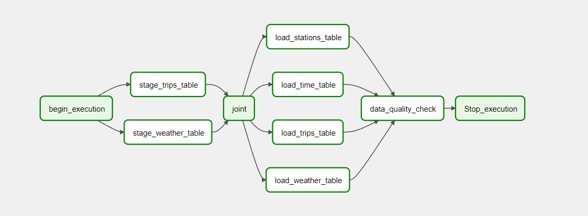
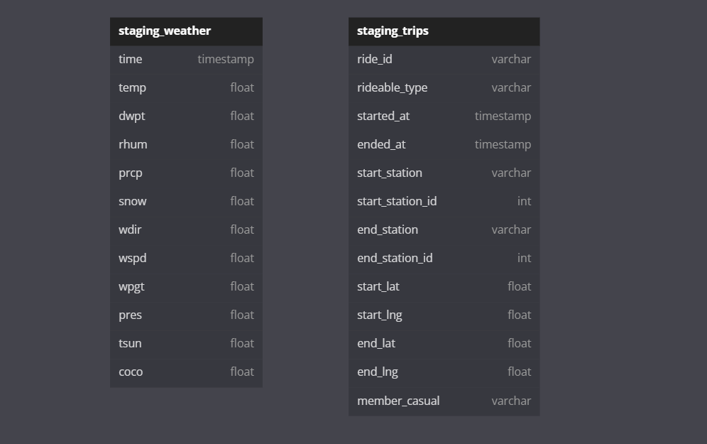
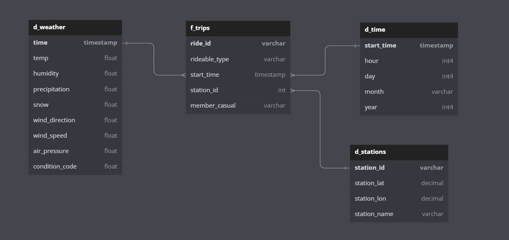
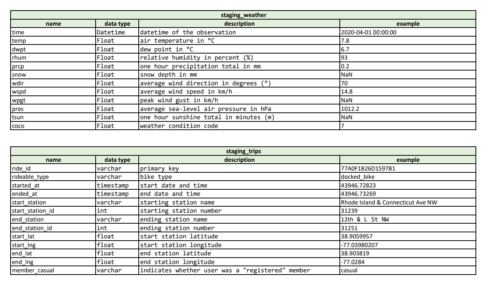
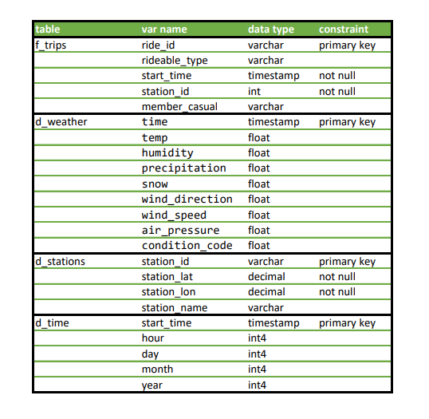
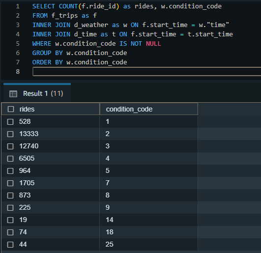
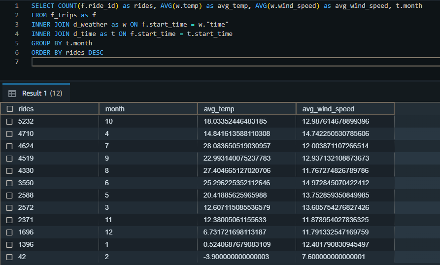

# Data Pipelines with Airflow

## Overview

Runs an ELT data pipeline using Apache-Airflow to collect weather data from [meteostat](https://dev.meteostat.net/python/)
Python API and trips data from a bike share company located in Washington, D.C. and combines both datasets into a star
schema in Redshift to create an easy-to-use model for machine learning to make predictions on the number of
bike share users in relation to weather. The pipeline will execute monthly and update the data in the cluster.

### Prerequisites:
- Create an IAM User in AWS with appropriate permissions.
- Create a redshift cluster in AWS. Ensure that you are creating this cluster in the us-west-2 region since the S3
bucket used is located in said region.
- [Start](https://airflow.apache.org/docs/apache-airflow/2.4.1/start.html) an Airflow web server with the compatible version.

### Steps
Once in the airflow web UI:
- add Redshift and AWS credentials to the connections by going to Admin -> connections -> Create
- run create_tables dag and wait for the dag to finish
- run load_data dag (this might take a long time to complete all the tasks)

Pipeline looks as follows:

## Schema

The [Star schema](https://en.wikipedia.org/wiki/Star_schema) makes it easy to query and organize large amounts of data,
aggregate it into smaller chunks and use it for business intelligence and analytics. Since the datasets don't include a
large variety of columns and we don't need to use multiple joins, this schema is ideal for the warehouse.
 
All data is first staged into two tables in Redshift; then, usable data is copied into different tables to
build the schema structure.

## Data

### Bike share trips

[Capital Bikesahre](https://ride.capitalbikeshare.com/system-data), data is stored in S3 formatted as 'zip', but Redshift is unable to process
them with a 'Copy' command; thus, I downloaded the files, unzipped them and transferred the files into a new S3 bucket(s3://gz-capitalbikeshare-data).
This process can be done via script or using Airflow's 
[S3FileTransformOperator](https://airflow.apache.org/docs/apache-airflow-providers-amazon/stable/_api/airflow/providers/amazon/aws/operators/s3/index.html).
Note: I'm planning to add the script to the project in the future to fully automate the pipeline, including unzipping the data and upload it in a
suitable format. Files' name come in the format: YYYYMM-capitalbikeshare-tripdata.csv

### Weather
[Meteostat](https://dev.meteostat.net/python/)'s python API, which provides weather and climate data, given a time interval and
location, in form of a pandas DataFrame, that looks as shown below:

Raw data comes in the following format:

And is then transform into:

## Write Up

### Scope

The project aims to automate a pipeline to fetch the necessary data from the providers, and update the tables
accordingly. I decided to use Apache-Airflow as the scheduler to have an intuitive structure of the workflow.

I used AWS S3 and Redshift to make the dataset scalable, highly available, and fast, along with their compatibility with
Airflow. Redshift provides great performance on large data sets, access to a broad range of different SQL clients,
and an easy way to copy data from S3.

Weather data involves a much smaller dataset, which can be fetched via API and directly pushed into Redshift through
an Airflow operator. However, this may exeed Airflow's memory limit and might take a few retries before fully execute.

### Sample queries

As an easy example of how weather affects bike share users, when we compare the relation between `condition_code` and
the number of rides, we can see how most rides occur in values between 2-4:

Also, some values have a stronger influence on bike use, like temperature and wind speed. Due to the
seasons, the temperature has a high impact on the bike share industry, as the rides decrease noticeably between 
December and February, but there is a low deviation in the wind speed throughout the year:

### Addressing Other Scenarios

Airflow allows us to easily build a schedule for all the tasks. Since bike share data is uploaded monthly, in case the
pipelines would be run daily it would be essential to check the date of the last updated data, to avoid
overwriting and only append newer data to make it more efficient.
 
S3 and Redshift offer scalability and support for large amounts of clients, which makes them appropriate in case
the amount of data and requests were increased.